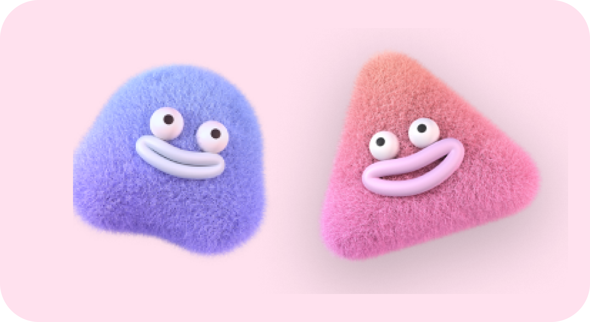
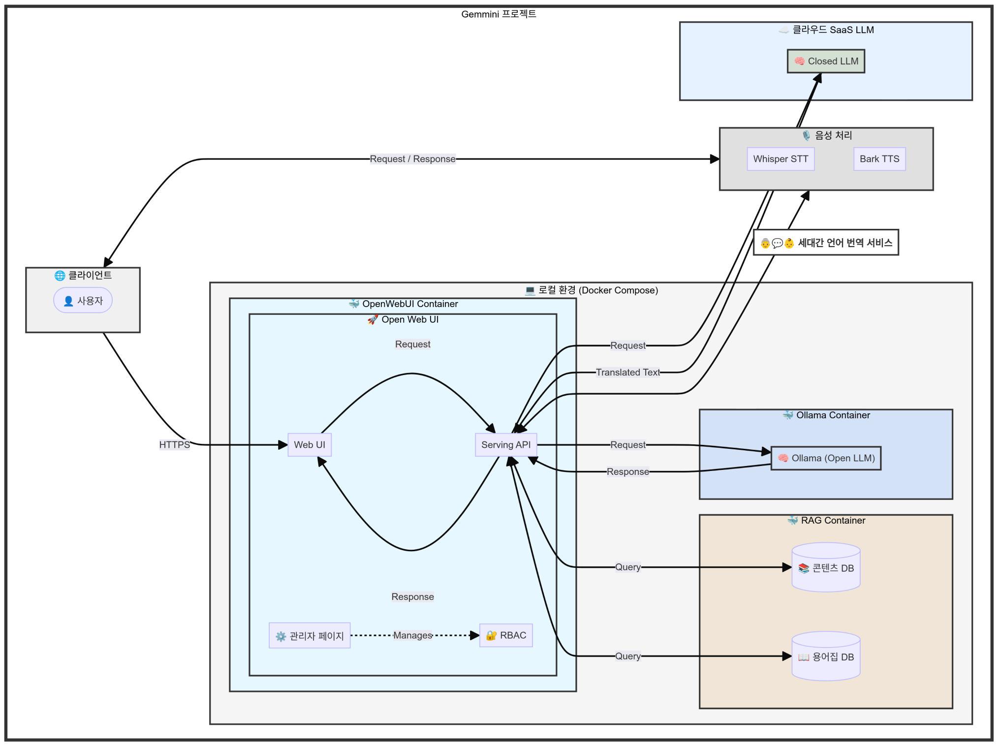
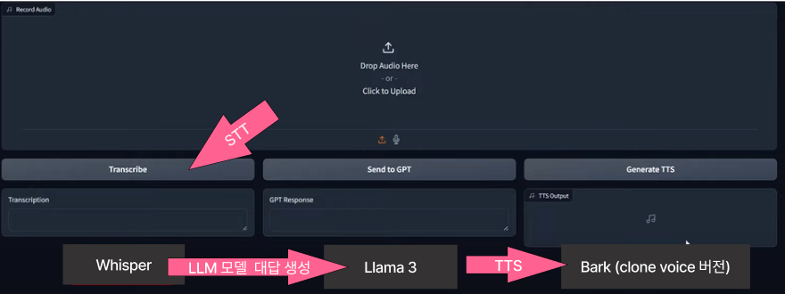
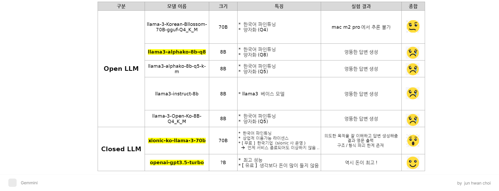

# Gemmini: 세대간 언어 번역기



> Gemmini는 세대 간 언어 차이를 극복하고 원활한 소통을 돕는 AI 기반 번역 서비스입니다. 각 세대의 특징적인 표현과 은어를 상대방이 이해하기 쉬운 언어로 번역해 이해할 수 있게 만들어 줘요!

## 팀 구성원

김성준(<ksjhshl@naver.com>) / 최준환(<wnsksl0527@gmail.com>)

## 활용 데이터

- aihub: [연령대별 특징적 발화(은어·속어 등) 음성 데이터](https://www.aihub.or.kr/aihubdata/data/view.do?currMenu=&topMenu=&aihubDataSe=data&dataSetSn=71320)


- **데이터셋 이름**: 연령대별특징적발화음성
- **출처**: AIHub
- **버전**: 1.0
- **포맷**: JSON, WAV 파일
- **크기**: 545.73 GB

### 데이터 설명

| 항목               | 설명                                | 타입        | 예시                                                      |
|--------------------|-------------------------------------|-------------|-----------------------------------------------------------|
| DataSet            | 데이터셋                            | String      | 연령대별특징적발화음성                                    |
| Version            | 데이터셋 버전                       | String      | 1.0                                                       |
| Date               | 녹음 날짜                           | String      | 20220523                                                  |
| MediaUrl           | 녹취된 음원의 URL                  | String      | 대화/20대/26.일상/20_26_42785278_220906_0001.wav           |
| Category           | 연령대 분류                         | String      | 20대                                                      |
| Subcategory        | 주제별 분류                         | String      | 일상                                                      |
| DialogPlace        | 발화 장소                           | String      | 사무실                                                    |
| DialogVoiceType    | 대화 유형                           | String      | 대면대화                                                  |
| SpeakerNumber      | 화자 수                              | String      | 2                                                         |
| RecDevice          | 녹음 장치                            | String      | 녹음장치                                                  |
| RecLen             | 전체 녹음 시간 (초)                 | Number      | 60                                                        |
| AudioResolution    | 오디오 레졸류션                     | Object      | {BitDepth: '16bit', SampleRate: '44.1kHz'}                |
| Speakers           | 화자 정보                           | Array       | [{Speaker: '4278', Gender: '남성', Locate: '수도권', Agegroup: '30'}] |
| Dialogs            | 전사 데이터 목록                    | Array       | [{Speaker: '4278', Speakertext: '오늘 점심은 뭐로 할까? 점메추 좀~', TextConvert: '오늘 점심은 뭐로 할까? 점심메뉴추천 좀~', StartTime: 1, EndTime: 4, SpeakTime: 3, WordInfo: [{Word: '점메추', WordType: '줄임말', WordStructure: '축약어', WordDefine: '점심 메뉴 추천', WordFell: '중립', WordMean: '궁금'}]}] |

### 데이터 전처리

특수 문자 및 비라틴 문자(한글 제외)를 제거
```sh
def remove_special_characters(text):
    if isinstance(text, str):
        # 한글, 영어, 숫자, 공백을 제외한 모든 문자 제거
        text = re.sub(r'[^가-힣a-zA-Z0-9\s]', '', text)
        text = re.sub(r'\s+', ' ', text)  # 여러 공백을 하나로 변환
        return text.strip()  # 앞뒤 공백 제거
    else:
        return str(text)
```


## 주요 기능

- 세대별 언어 스타일 분석 및 변환
- 실시간 채팅 Q&A
- 음성 인식을 통한 채팅 지원
- 다국어 지원

## 기술 스택

- langchain
- llama-index
- open-web-ui
- pipelines

## 활용 모델

Open LLM:

- open-ai-gpt3.5-turbo
- xionic-ko-llama-3-70b

Closed LLM:

- llama-3-Korean-Bllossom-70B-gguf-Q4_K_M
- llama3-alphako-8b-q8
- llama3-alphako-8b-q5-k-m
- llama3-instruct-8b
- llama-3-Open-Ko-8B-Q4_K_M

## 아키텍처


<br>

# 시작하기

## 파이썬 요구 사항

- Python 3.11+
- TensorFlow 2.0+
- PyTorch 1.8+

## 환경 구성

multi-modal

```sh
pip install -r requirements-multi-modal.txt
```

chat-qa

```sh
pip install -r requirements-chat-qa.txt
```

## Multi Modal App (gradio)


```
```

## Chat QA App (open-web-ui)

### Ollama / Local LLM 설치

- 플랫폼에 맞게 Ollama 설치: <https://ollama.com/download>
- `model/README.md`를 참고하여 로컬 모델 Load

### Docker 실행

- open web ui

```sh
docker run -d -p 3000:8080 --add-host=host.docker.internal:host-gateway -v open-webui:/app/backend/data --name open-webui --restart always ghcr.io/open-webui/open-webui:main
```

- pipelines

```sh
docker run -d -p 9099:9099 --add-host=host.docker.internal:host-gateway -v pipelines:/app/pipelines --name pipelines --restart always ghcr.io/open-webui/pipelines:main
```

### 프롬프트 구성

### 모델 비교

모델을 자원의 한계와 정성적 평가 방식으로 진행함



1. 세대 간 언어 번역의 경우, 시대적 맥락과 문화적 뉘앙스가 중요하여 단순한 수치 지표로 평가하기 어려움

2. 창의적 표현이나 의역의 적절성을 객관적인 수치로 나타내기 어려워 정량적 평가만으로는 번역의 질을 완전히 반영하기 어렵기 때문
